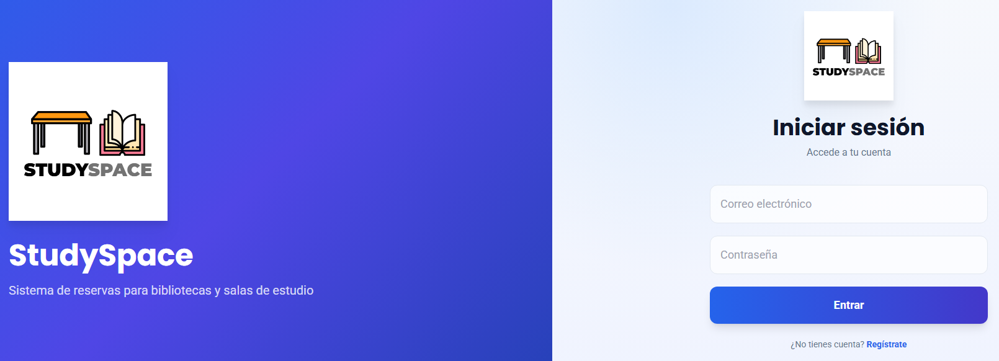
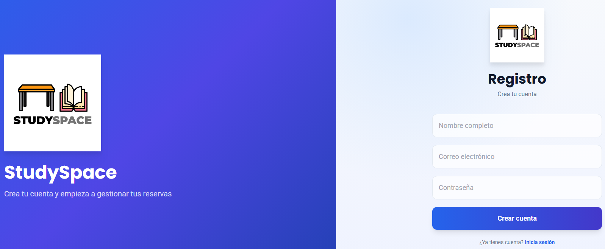
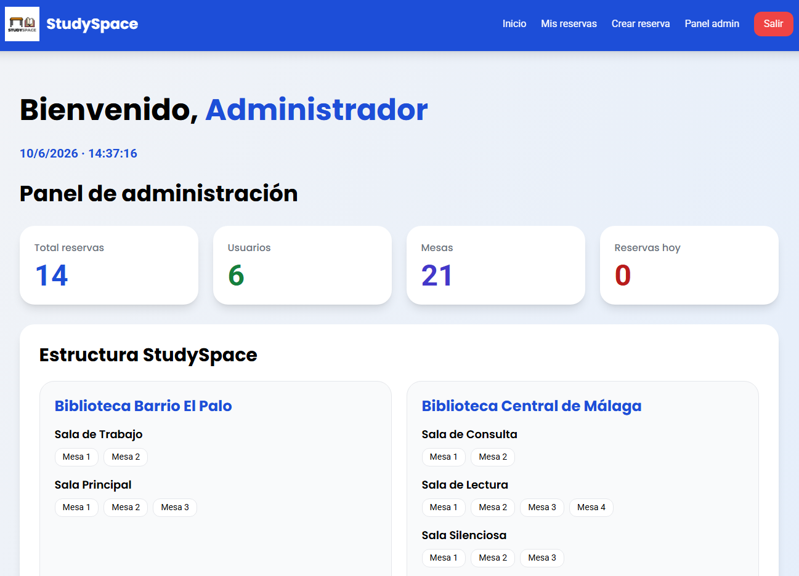
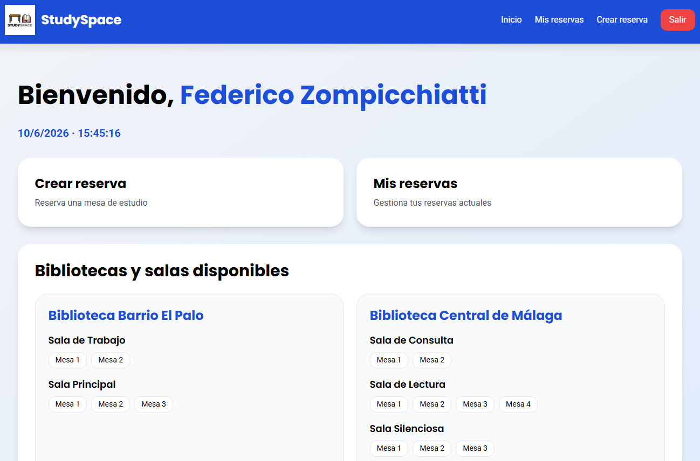
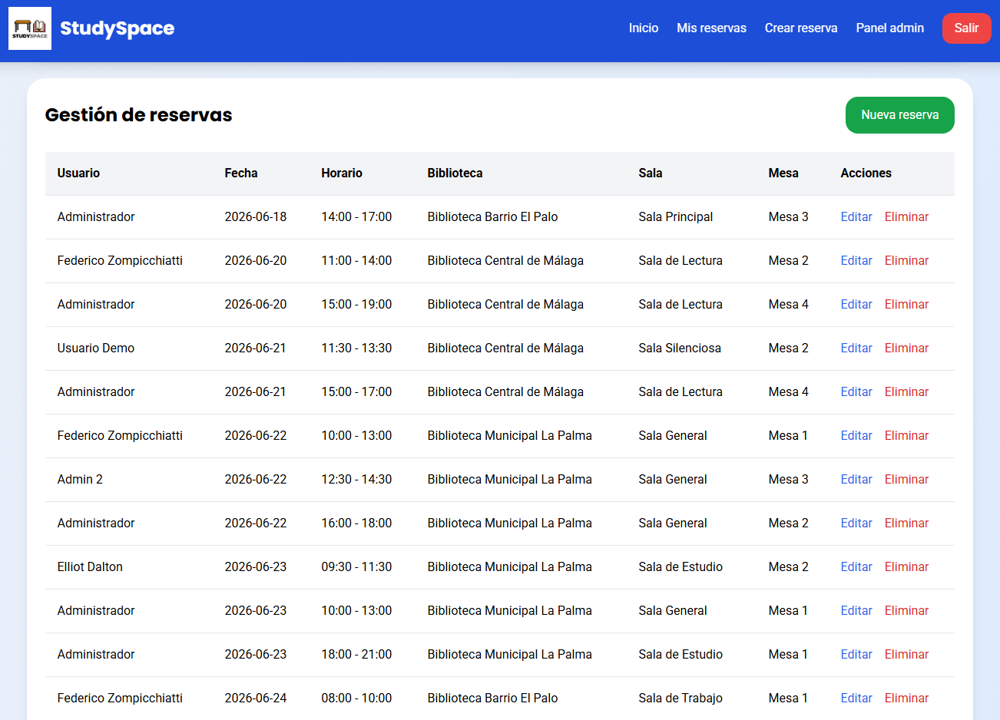
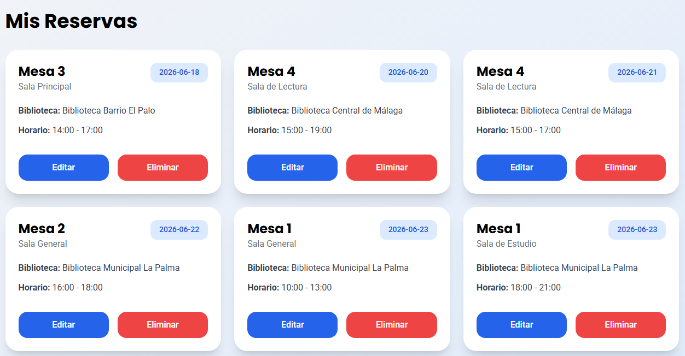
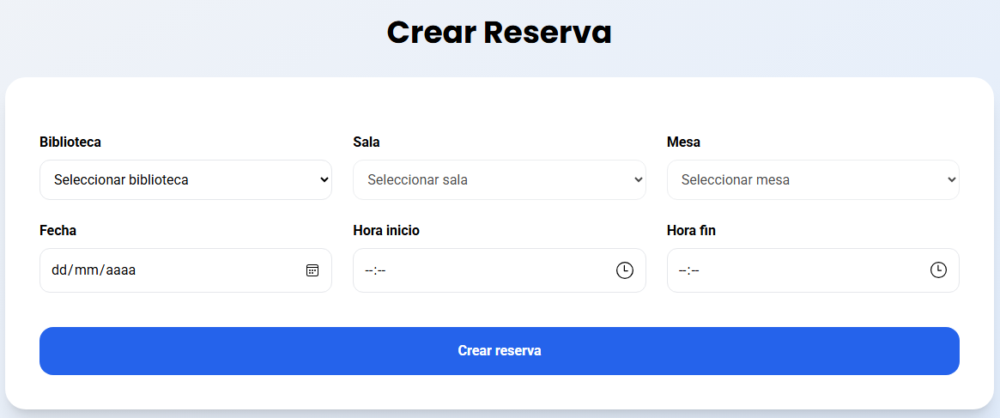
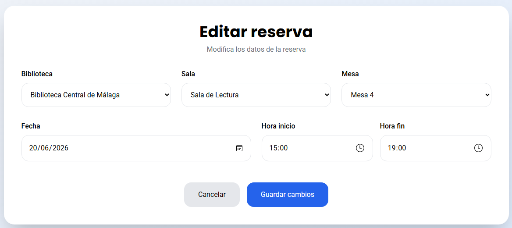

# 📚 StudySpace - Sistema de Gestión de Reservas de Estudio

<p align="center">
  
</p>

StudySpace es una aplicación web desarrollada como Proyecto Final del Ciclo Formativo de Grado Superior en Desarrollo de Aplicaciones Web (DAW). Su objetivo es digitalizar y gestionar el sistema de reservas de espacios de estudio dentro de bibliotecas, permitiendo a los usuarios reservar mesas de forma sencilla y a los administradores gestionar la disponibilidad y estadísticas en tiempo real.

---

## 🚀 Funcionalidades principales

### 👤 Usuarios
- Registro e inicio de sesión
- Gestión de reservas personales
- Visualización de historial de reservas
- Eliminación de reservas
- Sistema de filtros en listado de reservas

### 🏛️ Sistema de reservas
- Selección dinámica de biblioteca → sala → mesa
- Control de disponibilidad en tiempo real
- Creación de reservas mediante AJAX (Fetch API)
- Eliminación y actualización sin recarga de página

### 📊 Panel de administración
- Estadísticas en tiempo real:
  - Total de reservas
  - Total de usuarios
  - Total de mesas
  - Reservas del día
- Dashboard dinámico con API REST
- Visualización de estructura completa (Tree: bibliotecas → salas → mesas)
- Gestión completa de reservas

---

## 🧠 Arquitectura del proyecto

El proyecto está construido en **PHP puro** con arquitectura MVC propia, sin frameworks, con el objetivo de comprender el flujo completo de una aplicación web desde cero.

---

## 📁 Estructura del proyecto

```
studyspace/
│   .gitignore
│   LICENSE
│   README.md
│
├───/app
│   ├───/controllers
│   │       AdminController.php
│   │       ApiController.php
│   │       AuthController.php
│   │       MesaController.php
│   │       ReservaController.php
│   │       SalaController.php
│   │
│   ├───/middleware
│   │       AdminMiddleware.php
│   │       AuthMiddleware.php
│   │
│   ├───/models
│   │       Biblioteca.php
│   │       Estadistica.php
│   │       Mesa.php
│   │       Reserva.php
│   │       Sala.php
│   │       Usuario.php
│   │
│   ├───/services
│   │       AuthService.php
│   │       DashboardService.php
│   │       MesaService.php
│   │       ReservaService.php
│   │       SalaService.php
│   │
│   └───/views
│       ├───/auth
│       │       login.php
│       │       registro.php
│       │
│       ├───/dashboard
│       │       admin.php
│       │       usuario.php
│       │
│       ├───/layouts
│       │       footer.php
│       │       header.php
│       │
│       └───/reservas
│               crear.php
│               editar.php
│               mis_reservas.php
│
├───/config
│       database.php
│
├───/core
│       BaseController.php
│       helpers.php
│       Model.php
│       Router.php
│
├───/database
│       seed.sql
│       studyspace.sql
│
├───/public
│   │   .htaccess
│   │   index.php
│   │
│   └───/assets
│       ├───/img
│       │       CapturaCrearReserva.png
│       │       CapturaDashboarAdmin.png
│       │       CapturaDashboardUsuario.png
│       │       CapturaEditarReserva.png
│       │       CapturaLogin.png
│       │       CapturaRegistro.png
│       │       ListaMisReservas.png
│       │       ListaTodasReservas.png
│       │       logo.png
│       │
│       └───/js
│               dashboard.js
│               reservas.js
│               ui-system.js
│
├───/routes
│       api.php
│       web.php
│
└───/storage
        .gitkeep
```


---

## 🛠️ Stack tecnológico

| Tecnología | Uso |
|------------|-----|
| PHP 8 | Backend MVC propio |
| MySQL | Base de datos relacional |
| JavaScript (Vanilla) | Interacción frontend |
| Fetch API | Comunicación asíncrona |
| Tailwind CSS | UI y estilos |
| Apache (XAMPP) | Entorno local |

---

## ⚙️ Configuración de base de datos

El proyecto utiliza MySQL en desarrollo local con XAMPP. La versión de XAMPP utilizada es la 8.2.12.

```php
DB_HOST=127.0.0.1
DB_USER=root
DB_PASS=
DB_NAME=studyspace
DB_PORT=3307
```

---

## 📡 API endpoints principales

### Auth
- `/login`
- `/registro`
- `/logout`

### Reservas
- `/mis-reservas`
- `/crear-reserva`
- `/actualizar-reserva`
- `/eliminar-reserva`

### API REST
- `/api/stats`
- `/api/bibliotecas-tree`
- `/api/mis-reservas`

---

## ⚡ Actualización en tiempo real

El sistema utiliza `fetch()` para actualizar datos sin recargar la página:

- Eliminación instantánea de reservas
- Dashboard en tiempo real
- Tree dinámico de bibliotecas/salas/mesas
- Actualización automática de estadísticas

---

## 📸 Capturas del sistema

### 🔐 Login


### 📝 Registro


### 📊 Dashboard Admin


### 👤 Dashboard Usuario


### 📋 Todas las reservas


### 📄 Mis reservas


### ➕ Crear reserva


### ✏️ Editar reserva


---

## 🔧 Instalación y ejecución

```bash
git clone https://github.com/tu-usuario/studyspace.git
```

### 📂 Pasos de instalación

- Colocar el proyecto en:

```
git clone https://github.com/tu-usuario/studyspace.git
```

- Iniciar servicios
  - Apache
  - MySQL
- Crear base de datos:
```
studyspace
```
- Importar base de datos:
```
database/studyspace.sql
```
- Acceder a la aplicación
```
http://localhost/studyspace/public/
```

---

## 👨‍💻 Autor

Proyecto desarrollado por Álvaro Mozo Gaspar
Proyecto Final del Ciclo Formativo de Grado Superior en Desarrollo de Aplicaciones Web (DAW)
IES Playamar